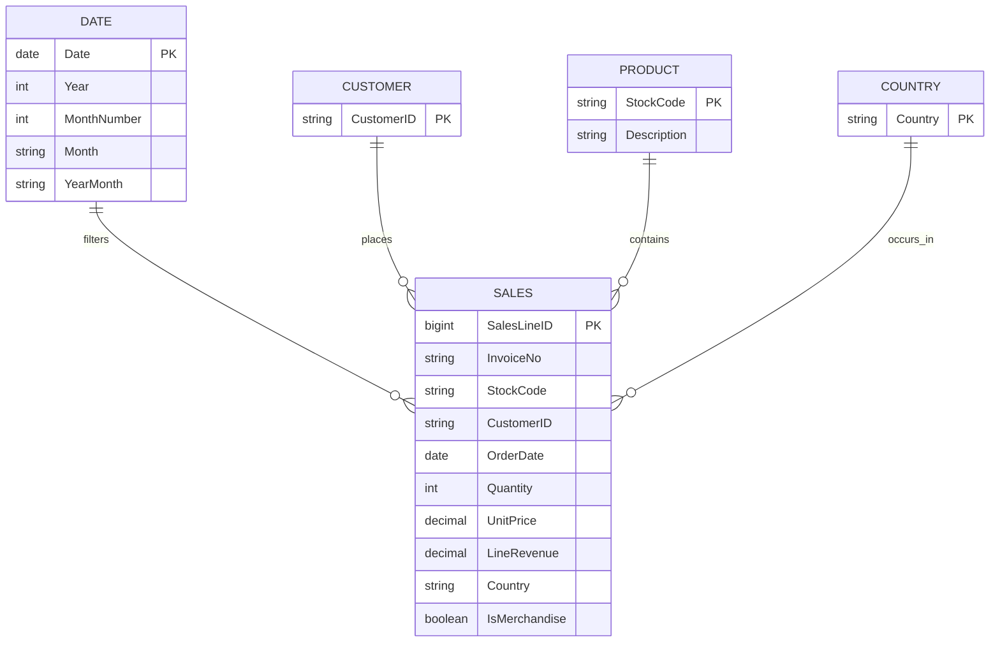

# Data Model

```mermaid
erDiagram
    DATE ||--o{ SALES : filters
    CUSTOMER ||--o{ SALES : places
    PRODUCT ||--o{ SALES : contains
    COUNTRY ||--o{ SALES : occurs_in

    DATE {
      date Date PK
      int Year
      int MonthNumber
      string Month
      string YearMonth
    }
    SALES {
      bigint SalesLineID PK
      string InvoiceNo
      string StockCode
      string CustomerID
      date OrderDate
      int Quantity
      decimal UnitPrice
      decimal LineRevenue
      string Country
      boolean IsMerchandise
    }
    CUSTOMER {
      string CustomerID PK
    }
    PRODUCT {
      string StockCode PK
      string Description
    }
    COUNTRY {
      string Country PK
    }
```
